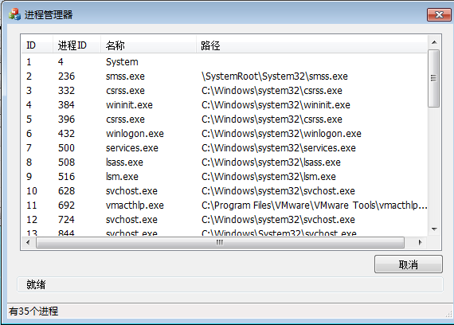

#进程管理器

-

原代码作者:[Gotogoo](http://www.cnblogs.com/Gotogoo/p/5259047.html)

-

修改了部分代码，支持Win7 32和64位系统，其它系统部分的代码没有写。仅实现了进程的枚举，其它功能未实现。

-

###原理：

通过自身的EPROCESS结构体的双向链表枚举出系统中所有的进程的EPROCESS。

获取PID的核心API:

	HANDLE PsGetProcessId(_In_ PEPROCESS Process);

####获取程序名和路径
读取PEB结构体的_RTL_USER_PROCESS_PARAMETERS ProcessParameters，ProcessParameters中包含所需的信息。

x86：_EPROCESS
 +0x0b8 ActiveProcessLinks : _LIST_ENTRY

 +0x1a8 Peb              : Ptr32 _PEB

x64：_EPROCESS
 +0x188 ActiveProcessLinks : _LIST_ENTRY

 +0x338 Peb              : Ptr64 _PEB

x64： _RTL_USER_PROCESS_PARAMETERS

   +0x060 ImagePathName    : _UNICODE_STRING

   +0x070 CommandLine      : _UNICODE_STRING

-

